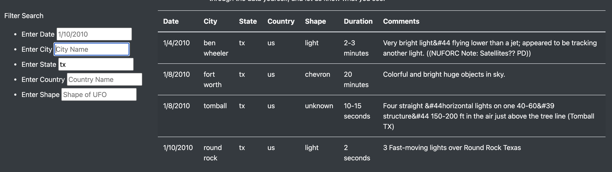
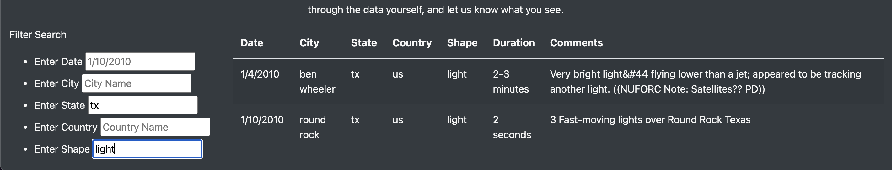

# UFOs

## Project Overview

For this project I will be creating a dynamic webpage in order to both hold and display ufo data. In order to create the dynamic webpage, I will be using javascript, HTML, and CSS. The main component to this project will be javascript, a front end developing language that will allow me to add extra functions and customizations to my html page. 

With the help of javascript, I was able to build a table that holds the ufo sightings data, and neatley display that table onto an html file. After this table wsa created, I was able to create a function within my javascript file capable of filtering the displayed data based on dates. Considering the success of the initital file, I was charged with the task of refractoring my code in both javascript and html in order to handle additional filters within to the table. In the results subsection below, I examine the functionallity of the website and address possbile improvements to our filters.

Below is a visual representation of the final product displayed on my html code.

## Results

The refractored code allows for users to be able to filter based on a 4 additional columns in our table. The new filters added allow users to select City, State, Country, and Shape. 

In each filter tab we see a label, as well as a placeholder within the cell that indicates the desired search criteria. In the image below I test out the filter by searching for ufo sightings in my home state of Texas, with the states abbreviation (tx).

One of the key functionality features of the table is that we are able to search based on multiple criteria, not just one. In the image below, I refine the search results for the state of Texas, by searching for UFO shapes that were reported as "light."

## Summary
One of the potential challenges to the current format of this code is that it is not designed to handle variability in the search filters. For example, if we were to search for the city in Texas known as Fort Worth, with the text as follows "fortworth" the results of the search would not appear. This can be an issue for users who do not notice a pattern in the formatting of the data.

I would recommend refactoring the code to handle variablility in the results that would recognize different forms of the search criteria. The first thing that comes to my mind are regular expressions which I first encountered with python. Regular expressions allow us to recognize different variations of words, numbers, etc., and map them out to one standard format. Since javascript is capable of handling regular expressions as well, we can use the regular expressions in order to handle variability in the format of user searches.

For now we can just be grateful that we have a functional website.
