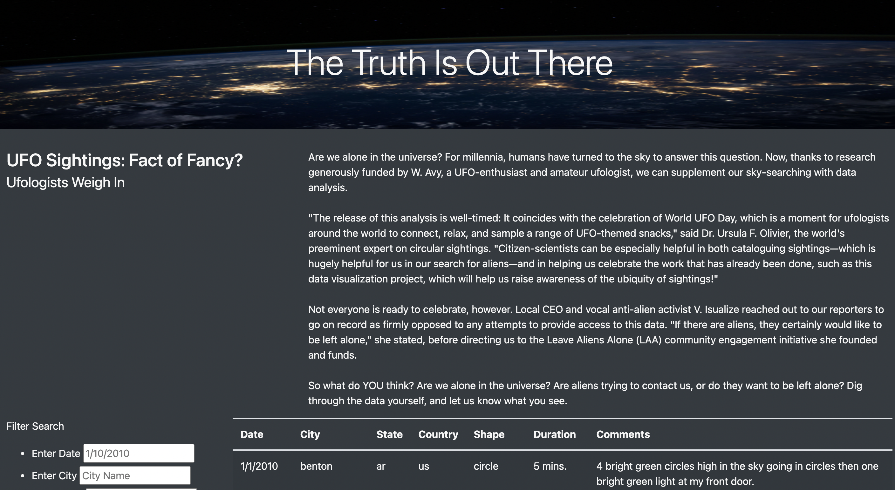

# UFOs

## Project Overview

In this project I am helping Dana, a Date Reporting Journalist who is working on a project designed to analyze UFO sightings. Our source of data stems from a javascript file that is filled with specific data on reported UFO sightings. In this module I was able to use a combination of javascript and html for a visual display of a table held on an html file designed to hold all of the key-value parings that were given. I was able use a javascript file to create a function designed to filter the results of the table based on user filter by date input by date, after this the table was created in html, importing both the data as well as my app.js file. 

For this challenge I am tasked with refactoring the code for both my html file and my app.js file. This refactoring is designed handle user inputs for additional search criteria that will make for a more interactive user interphase.

## Results

On the site users are able to filter based on a variety of options including Date, City, State, Country, and Shape. 

In each filter tab we see a label, as well as a placeholder within the cell that indicates the desired search criteria. In the image below I test out the filter by searching for my home state of Texas, with the states abbreviation (tx).

We are also able to search based on multiple criteria, not just one. In the image below I refine the search results by searching for UFO shapes that were reported as "light."

## Summary
One of the potential challenges to the current format of this code is that it is not designed to allow variability in the search filters. For example, if we were to search for the city in Texas known as Fort Worth, with the text as follows "fortworth" the results of the search would not appear. I would recommend refactoring the code to handle variablility in the results that would recognize different forms of code. With a method like that of pythons regular expressions, we would be able to handle variations in the text inputs. 

For now we can just be grateful that we have a functional website.
